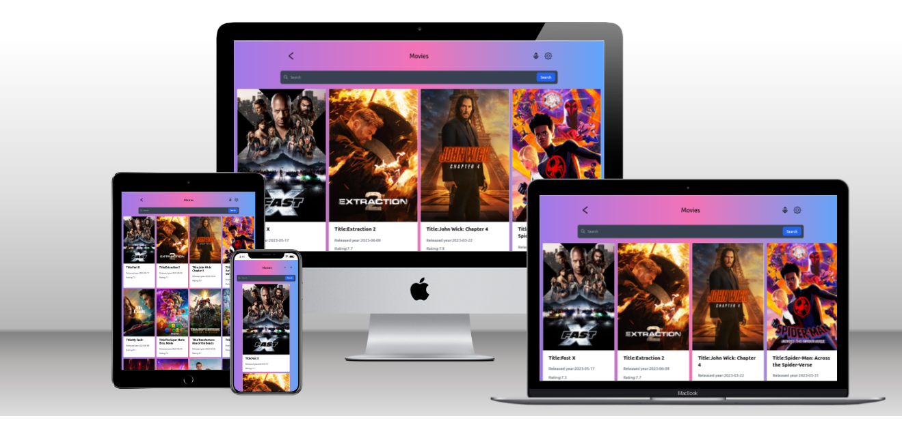

<a name="readme-top"></a>

<div align="center">

  # Popcorn Flix
  

</div>

# 📗 Table of Contents

- [📖 Popcorn Flix](#-popcorn-flix-)
  - [🛠 Built With ](#-built-with-)
    - [Tech Stack ](#tech-stack-)
    - [Key Features ](#key-features-)
    - [Prerequisites](#prerequisites)
    - [Setup](#setup)
    - [Install](#install)
    - [Usage](#usage)
    - [Run tests](#run-tests)
    - [Deployment](#deployment)
  - [👥 Author ](#-author-)
  - [🔭 Future Features ](#-future-features-)
  - [🤝 Contributing ](#-contributing-)
  - [⭐️ Show your support ](#️-show-your-support-)
  - [🙏 Acknowledgments ](#-acknowledgments-)
  - [📝 License ](#-license-)

<!-- PROJECT DESCRIPTION -->

# 📖 Popcorn Flix<a name="about-project"></a>

The Popcorn Flix App is the Capstone project for React module three where we are required to build an SPA utilizing the concepts we learnt. I used Axios to make calls to a movies API to fetch data, I used Redux( useSelector and useDispatch) to update the state by filtering movies by  title. I can navigate from the home page to a single movie page dynamically using React router, and fetch data with useEffect on page load and with action dispatch, finally, I used Jest and React Testing Library to make component tests and mock API calls.

## 🛠 Built With <a name="built-with"></a>

### Tech Stack <a name="tech-stack"></a>


<!-- Features -->

### Key Features <a name="key-features"></a>

- Routing using react-router.
- App-wide State Management with Redux/Toolkit.
- Styling with Tailwind CSS.
- Data-fetching with Axios.
- Testing with Jest and React Testing Library.

<p align="right">(<a href="#readme-top">back to top</a>)</p>

<!-- LIVE DEMO -->

### Live Demo <a name = "live-demo"></a>
[Popcorn Flix](https://popcorn-flix.netlify.app/)

### Video Presentation <a name = "video-Presentation"></a>
[Presentation](https://www.loom.com/share/6168d6339b3d4286b0d21b746a44cfb5)
### Prerequisites

In order to run this project you need to have the following installed:

```sh
- A web browser
- A code editor
- A terminal
- Git
- Node.js
```

### Setup

Clone this repository to your desired folder:

```sh
  cd my-folder run `git clone https://github.com/lincoln1883/net-flix-capstone/`
```

### Install

Install this project with:

```sh
  cd my-folder run `npm install`
```

### Usage

To run the project, execute the following command:

open the index.html file in your browser using the live server extension.

### Run tests

To test please execute the following command:

```sh
    run `npm test`
```

<p align="right">(<a href="#readme-top">back to top</a>)</p>

<!-- AUTHORS -->

## 👥 Author <a name="authors"></a>

####👤 Lincoln Gibson

- GitHub: [lincoln1883](https://github.com/lincoln1883)
- Twitter: [lincolngibson7](https://twitter.com/lincolngibson7)
- LinkedIn: [lincoln-gibson](https://linkedin.com/in/lincoln-gibson)

<!-- FUTURE FEATURES -->

## 🔭 Future Features <a name="future-features"></a>


<p align="right">(<a href="#readme-top">back to top</a>)</p>

<!-- CONTRIBUTING -->

## 🤝 Contributing <a name="contributing"></a>

Contributions, issues, and feature requests are welcome!

Feel free to check the [issues page](../../issues/).

<p align="right">(<a href="#readme-top">back to top</a>)</p>

<!-- SUPPORT -->

## ⭐️ Show your support <a name="support"></a>

- Give a ⭐️ if you like this project!

<p align="right">(<a href="#readme-top">back to top</a>)</p>

<!-- ACKNOWLEDGEMENTS -->

## 🙏 Acknowledgments <a name="acknowledgements"></a>

- Thank you Microverse.
- Original design idea by Nelson Sakwa on Behance.

<p align="right">(<a href="#readme-top">back to top</a>)</p>

<!-- LICENSE -->

## 📝 License <a name="license"></a>

This project is [MIT](./LICENSE) licensed.

<p align="right">(<a href="#readme-top">back to top</a>)</p>